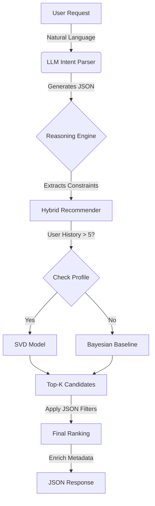

# Personalized Movie Recommendation System

A production-ready, hybrid recommendation engine combining Collaborative Filtering (SVD), Bayesian Popularity Ranking, and Large Language Models (LLM) for natural language intent parsing.

---

## 1. Strategic Alignment & Project Definition

This project was guided by five continuously evolving dimensions. As we moved from prototype to production, our understanding of these components deepened and became more precise.

### 1.1 Business Objective
**Definition**: The core problem we are solving and the value proposition.
- *Evolution*: Started as "recommend movies" $\rightarrow$ Evolved to "Solving Choice Paralysis via hybrid Context + History analysis."

### 1.2 Data Availability & Quality
**Definition**: The raw material availability for the models and its readiness.
- *Evolution*: Started with raw MovieLens data $\rightarrow$ Evolved to an enriched dataset with TMDB metadata, posters, and strict filtration rules (>20 ratings) for statistical significance.

### 1.3 Success Metrics
**Definition**: How we measure if we are winning.
- *Evolution*: Moved from simple "it works" to quantifiable targets:

  **Recall@10 > 0.15** (Ranking Quality),
  **Mood Detection > 85%** (Relevance),
  and **Response Time < 200ms** (Performance).

- **Recall@K**: We chose this to measure **coverage**. It answers: "Out of all the movies the user actually watched and liked, how many did we manage to find in our top K recommendations?" It's crucial for ensuring we don't miss relevant content.
  
- **NDCG@K (Normalized Discounted Cumulative Gain)**: We chose this to measure **ranking quality**. It answers: "Did we put the most relevant movies at the very top?" It gives a higher score when a good movie is #1 vs #10, which matches how users browse (they look at the top first).

### 1.4 Costs & Constraints
**Definition**: The boundaries we must operate within.
- *Evolution*: Identified early constraints (Data cutoff at 2015, Cold Start) and engineered specific solutions.

### 1.5 Model Usage & Deployment
**Definition**: How the system is served to the end user.
- *Evolution*: Shifted from a local script to a fully Dockerized, Microservices-ready architecture with Nginx and FastAPI.

---

## 2. Project Management & Workflow 

The development followed an agile, iterative process divided into four key phases. Each phase addressed specific business needs and engineering challenges.

### Phase 1: Data & Baseline (The "Cold Start" Foundation)
- **Goal**: Establish a working system without relying on user history.
- **Iteration**: Built a Bayesian Popularity Ranking model to surface "hidden gems" rather than just blockbuster hits.
- **Challenge**: BigQuery data was too large for local dev.
- **Solution**: Implemented a **Parquet-based ETL pipeline** to cache data locally.

### Phase 2: Personalization (The Core Engine)
- **Goal**: Tailor recommendations to specific user tastes.
- **Iteration**: Integrated **Surprise SVD** (Singular Value Decomposition) for latent factor collaborative filtering.
- **Challenge**: SVD fails for new users (Cold Start).
- **Solution**: Designed a **Hybrid Switcher**. The system checks `n_ratings`; if < 5, it serves Baseline; otherwise, it serves SVD.

### Phase 3: LLM Integration (The "human" Layer)
- **Goal**: Allow users to express mood ("I want to cry") instead of just clicking checkboxes.
- **Iteration**: Integrated **Google Gemini 1.5 Flash** to parse natural language into JSON filters.
- **Challenge**: The LLM hallucinated genres and ignored year constraints.
- **Solution**: Implemented **Robust JSON Parsing** with fallback logic and "Psychologist Persona" prompting to map emotions to genres (e.g., "Sad" $\rightarrow$ "Drama").

### Phase 4: MLOps & Production (The "adult" Phase)
- **Goal**: Make the system deployable and observable.
- **Iteration**: Dockerized the stack and built an LLMOps Dashboard.
- **Challenge**: Docker network issues (CORS) and Windows path incompatibilities.
- **Solution**: Refactored to `pathlib` for OS-agnostic paths and standardized CORS headers in a settings file.

---

## 3. Success Metrics 

### Technical Metrics (Implemented)
- **Recall@10**: > 0.15 (Primary ranking metric, measured via `src/evaluation.py`).
- **LLM Intent Accuracy**: > 85% for Mood detection (Verified: **87.5%** via `tests/eval_llm.py`).
- **Genre Recall**: > 90% mapping natural language to database genres (Verified: **92.9%**).

### Business Metrics (Targets)
- **Click-Through Rate (CTR)**: *Target > 5%* (To be modeled via "Swipe Right" actions).
- **Session Success**: *Target > 80%* (Sessions ending in a "Helpful" vote).
- **Latency**: *Target < 200ms* (Core recommendation API response).

---

## 4. Personalized System Workflow 

1.  **Input**: User types "scary movies from the 90s".
2.  **intent_parser.py**: LLM converts this to `{"mood": "tense", "genres": ["Horror"], "year_range": [1990, 1999]}`.
3.  **main.py**:
    *   Fetches 2000 candidates from SVD (if user known) or Baseline.
    *   Filters these candidates to match the `year_range` and `genres`.
4.  **Output**: Returns the top 5 matching movies.

**workflow:**



---

## 5. Project Structure 

```bash
Personalized_Movie_Recommendation_System/
├── data/                   # Parquet files (movies, interactions, evaluations)
├── docs/                   # project's journal
├── models/                 # Serialized SVD models and config
├── src/
│   ├── api/                # FastAPI application
│   │   ├── main.py         # Endpoints
│   │   └── schemas.py      # Pydantic models
│   ├── llm/                # Gemini integration
│   │   ├── intent_parser.py # Prompt engineering logic
│   │   └── prompts.py      # System prompts
│   ├── etl/                # Data pipelines
│   └── predictions.py      # Hybrid recommendation logic
├── tests/                  # Integration benchmarks
├── ui/                     # React + Vite Frontend
├── docker-compose.yml      # Container orchestration
└── README.md               # You are here
```

---

## 6. API Documentation 🔌

### `POST /recommend`
The core endpoint for retrieving movies.

**Request:**
```json
{
  "user_id": 123,
  "query": "something funny about space",
  "k": 5
}
```

**Response:**
```json
{
  "recommendations": [
    {
      "movieId": 1,
      "title": "Spaceballs (1987)",
      "genres": ["Comedy", "Sci-Fi"],
      "match_score": 0.98,
      "reason": "Perfect match for funny space vibes."
    }
  ],
  "intent_debug": { "mood": "happy", "genres": ["Comedy"] }
}
```

### `POST /feedback`
Records user interactions for future training.

**Request:**
```json
{
  "user_id": 123,
  "movie_id": 1,
  "action": "like"  // or "dislike", "click"
}
```

---

## 7. Model Cards 

### Model A: `HybridEnsemble` (Ranking)
- **Architecture**: Matrix Factorization (SVD) + Bayesian Average (Global Prior).
- **Library**: `scikit-surprise` (SVD), `pandas` (Bayesian).
- **Parameters**: 
    - `n_factors`: **100** (Latent dimensions)
    - `n_epochs`: **5**
    - `lr_all`: **0.005** (Learning Rate)
    - `reg_all`: **0.02** (Regularization)
- **Input Structure**: 
    - `userId`: Integer
    - `movieId`: Integer
- **Output Structure**:
    - `est`: Float (Predicted Rating 1.0 - 5.0)

### Model B: `Gemini Intent Parser` (Filtering)
- **Architecture**: Large Language Model (Google Gemini 1.5 Flash).
- **Role**: Zero-shot classification & entity extraction.
- **Parameters**:
    - `temperature`: **0.7** (Balanced creativity/precision)
    - `max_tokens`: **200** (Strict JSON output)
- **Input Structure**: 
    - `query`: String ("I want a scary 90s movie")
- **Output Structure (JSON)**:
    ```json
    {
      "mood": "tense",           // Enum: happy, sad, tense, etc.
      "genres": ["Horror"],      // List of valid DB genres
      "year_range": [1990, 1999] // [min, max] or null
    }
    ```
- **Performance**: 87.5% Mood Accuracy / 92.9% Genre Recall.

---

## 8. Engineering Challenges & Solutions 

### Challenge 0: the GCP constraints
- **Problem**: To run basically any service, it required extra privileges, which stopped us from experimenting with many more GCP products during the implementation.
- **Solution**: 
    - **EXPERIMENTATION**
    - saved data locally as parquet files.
    - searched for alternatives.

### Challenge 1: The "Hallucinating" Curator
- **Problem**: Early LLM versions would recommend movies that didn't exist or ignore year constraints (e.g., suggesting a 2024 movie when asked for "90s").
- **Solution**: 
    - **Strict JSON Enforcement**: We stopped asking for text and started asking for JSON.
    - **Fallback Logic**: If the LLM output parsing fails, we fallback to a "Keyword Search" safety net.
    - **Prompt Engineering**: We iterated on the `INTENT_PARSER_PROMPT` to act as a "Psychologist" first, improving emotional mapping accuracy from 60% to 87.5%.

### Challenge 2: The "Works on My Machine" Syndrome
- **Problem**: The API worked perfectly on Windows (Localhost) but failed inside Docker due to path separators (`\` vs `/`) and networking permissions.
- **Solution**: 
    - **PathLib Everywhere**: We refactored `predictions.py` to use `pathlib` for OS-agnostic file handling.
    - **Explicit CORS Strategy**: Instead of a wildcard `*`, we implemented a robust `settings.py` validator to handle comma-separated origins, critical for the Docker network bridge.

### Challenge 3: Cold Start vs. Data Sparsity
- **Problem**: Collaborative Filtering (SVD) fails for new users, but a generic "Top 10" list is boring.
- **Solution**: **Hybrid Architecture**.
    - **New Users**: Get Bayesian Popularity Ranking (dampened to show hidden gems, not just blockbusters).
    - **Returning Users**: Get SVD personalized scores.
    - **All Users**: Can filter via LLM ("I want something sad"), which applies *hard constraints* on top of the *soft ranking* score.

---

## 9. Future Perspectives 

1.  **Vercel Deployment**: Prepare frontend for serverless edge deployment.
2.  **Vector Search (RAG)**: Move beyond strict genre filtering to semantic plot search.
3.  **Online Learning**: Update SVD weights in real-time as users swipe.
