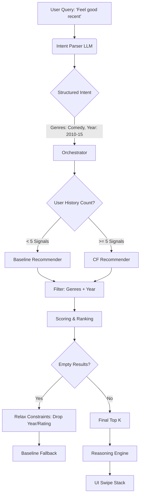

# LLM Integration Documentation

## Purpose
The LLM layer acts as the **Search Interpreter** and **Narrator**. It translates natural language ("mood") into precise filters and explains why a recommendation matches a user's unique history.

## Components

### 1. Intent Parser (`src/llm/intent_parser.py`)
- **Model**: `gemini-flash-latest` (Optimized for JSON extraction).
- **Function**: Converts queries like "90s comedies" into structured constraints.
- **Fail-safe**: If parsing fails, it defaults to `explore` mode with empty constraints.
- **Smart Mapping**: Maps moods like "chill" or "feel good" to `Comedy`, `Animation`, or `Romance` genres.
- **Database Awareness**: Since the database ends in 2015, the LLM maps "recent" requests to the [2010, 2015] range.

### 2. Reasoning Engine (`src/llm/reasoning.py`)
- **Model**: `gemini-flash-latest`
- **Function**: Compares user history with a candidate movie to generate a personalized pitch.
- **Output**: Enticing, casual sentence under 25 words.

## System Workflow Diagram

## Behavioral Logic
- **Batch Size**: The system uses `k=5` for efficient swiping and real-time adjustment.
- **Orchestration**:
    - **Baseline**: Bayesian Popularity.
    - **CF**: SVD Collaborative Filtering.
    - **Trigger**: Switches to CF automatically after 5 interaction signals (History + Current Session Swipes).
- **Constraint Merging**: LLM-parsed filters are merged with manual UI filters from the "Explore" screen.
- **Enrichment**: Metadata (posters, genres, year) are loaded *before* filtering to ensure accurate application of constraints.

## Interaction Loop
1. **Initial Load**: Backend returns 5 cards.
2. **Swipe Feedback**: User swipes. Feedback is logged to `feedback.jsonl`.
3. **Refinement**: UI triggers a re-recommendation when only 1 card remains.
4. **Matches Screen**: Users can exit the swipe loop anytime to see their "Matches" and "Top Suggestions".
